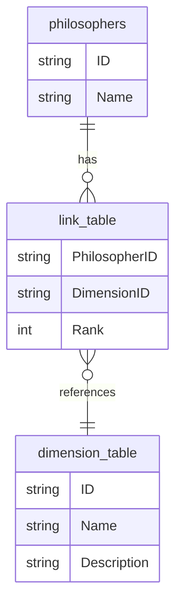

# Map of Philosophy: Reader Overview

This project is a guided map of philosophical thought across time, place, and tradition. It is designed to help readers see the big picture first, then move into specific thinkers, ideas, and debates.

## What This Map Covers

The map brings together philosophers from different eras and cultures so the reader can compare how they approached similar questions:

- Who are we, and what is reality?  
- How do we know what is true?  
- What makes an action good or just?  
- How should people and societies be governed?  
- What is the role of religion, reason, and human freedom?

## How to Read It

Each philosopher is presented as a short profile that describes, among other things:

- **Historical setting** – when and where they lived.  
- **Core ideas** – the main teachings they are known for.  
- **Major themes** – the topics they focused on most.  
- **Intellectual connections** – who influenced them and whom they influenced (within this map).

By highlighting different themes and connections, the map lets readers follow both continuity and change, from ancient schools to contemporary thought. These categories are not rigid labels; they are guideposts to navigate a very diverse intellectual landscape.

## Why This Is Useful

The map is meant to support different reading and study goals:

- Fast orientation for beginners  
- Cross‑tradition comparison for students  
- Idea‑tracking for deeper study  
- A reference point for discussion, writing, and teaching  

Instead of treating philosophers as isolated figures, it highlights philosophy as an ongoing conversation shaped by history, argument, and influence.

---

## How the Maps Are Made

The web app currently shows two complementary map types, each built from a different signal:

1. **Influence Map (Graph-Based)**
- Source data: the `Relations` table (`InfluencedByIDs` and `InfluencedIDs`).
- Method: build a directed graph where each philosopher is a node and each influence relationship is an edge.
- Embedding: run `node2vec` on that graph to learn a vector for each philosopher from network structure (who connects to whom).
- Projection: reduce those vectors to 2D (for plotting) and export coordinates used by the frontend.

2. **Semantic Map (Text-Based)**
- Source data: each philosopher's teaching summary (the `CoreTeachings` field in `philosophers.csv`).
- Method: generate OpenAI sentence embeddings for each teaching summary.
- Embedding: each philosopher gets a vector based on semantic similarity of ideas, language, and themes.
- Projection: reduce vectors to 2D (for example with t-SNE or UMAP) and export coordinates for visualization.

In short: the influence map groups thinkers by **historical/intellectual linkage**, while the semantic map groups them by **conceptual similarity in their teachings**.

Generated coordinate files are stored under `docs/data/` (for example `coords_node2vec_tsne.csv`, `coords_semantic_tsne.csv`, and `coords_semantic_umap.csv`), and are consumed by `docs/main.js` for rendering.

---

## Hosting Locally
With simple python server:
`python3 -m http.server 8000`


## Developer Env

### Python
Use `uv` (installed with homebrew for mac). Env setup:

`$ uv python install 3.12`
`$uv venv`
`source .venv/bin/activate`
`uv pip install networkx node2vec umap-learn pandas matplotlib scikit-learn jupyter`

I had to do this for older mac:
`uv pip install umap-learn numba --only-binary=numba,llvmlite`

Freeze requirements:
`uv pip freeze > requirements.txt`

### Checks (lint, tests, validation)

Install the (minimal) dev dependencies, then run the three gates:

```bash
pip install -r requirements-dev.txt   # or: make install-dev
make check                            # ruff + pytest + validate
```

`make check` is exactly what CI runs on every pull request
([`.github/workflows/ci.yml`](.github/workflows/ci.yml)), so a green local run
means a green PR. The gates individually:

```bash
make lint        # ruff check .
make test        # pytest
make validate    # python scripts/validate.py
make report      # python scripts/validate.py --report (category counts)
```

Validation is the important one: the site is a static read of `docs/data/`, so
a dangling ID never fails at build time -- it just renders a broken or invisible
philosopher. `validate.py` catches that before it ships.

Tests run against a throwaway dataset in a temp directory and never touch
`docs/data/`; a guard in `tests/conftest.py` fails the suite if they do.
Contributor and agent conventions live in [`AGENTS.md`](AGENTS.md).

## Data Structure Overview

All data lives under `docs/data/` as plain CSV/JSON so it's directly servable
by GitHub Pages with no build step. The project uses a small star schema:

1. **`philosophers.csv`** – the fact table: identity + narrative fields for each philosopher.
2. **`dimensions/` + `links/`** – ten categorical "dimensions" (Region, Era, School/Movement, ...), each with its own described vocabulary and a link table connecting philosophers to it.
3. **`relations.csv`** – the influence graph between philosophers (unchanged from before).

This replaces an earlier approach where every categorical field was free
text on a single `details.csv`, cleaned up after the fact with regex
classifiers. Now every category a philosopher can be tagged with already
exists, by name, with a written description, in a dimension table --
new data is validated against that vocabulary instead of drifting into new
ad hoc phrasing.

---

## 1. `philosophers.csv` (fact table)

**Purpose:** identity and narrative fields for each philosopher. All categorical/dimensional data has moved out to the dimension tables below.

**Columns**

1. `ID` – short unique ID (e.g. `P001`, `P002`), used as the primary key everywhere else.
2. `Name` – the full name, as you'd write it in prose.
3. `ShortName` – the label drawn on the map. Required and non-empty. See below.
4. `BirthYear` / `DeathYear` – integer years; negative for BCE (e.g. `-384` for 384 BCE). Can be blank or approximate.
5. `CoreTeachings` – 3-4 sentences: key doctrines, questions, and characteristic methods. The "core description" a reader sees first.
6. `HistoricalContext` – 2-3 sentences on when/where they lived, historical background, and roles they played.
7. `KeyWorks` – 2-5 titles, `;`-separated (e.g. `Nicomachean Ethics;Metaphysics;Politics`).
8. `Tags` – free-form `;`-separated keywords for anything that doesn't fit elsewhere.

### Why `ShortName` is stored rather than derived

The map has room for one short label per point. That used to be computed in the
frontend by taking the last word of `Name`, which fails in three ways:

| Pattern | Example | Derived | Correct |
| --- | --- | --- | --- |
| Parenthetical | `Siddhārtha Gautama (the Buddha)` | `Buddha)` | `Buddha` |
| "X of Place" | `Augustine of Hippo` | `Hippo` | `Augustine` |
| Family name first | `Zhu Xi` | `Xi` | `Zhu Xi` |

The last two matter most, because the wrong answer looks plausible: nobody
questions a label reading `Hippo` the way they question `Buddha)`.

The first two patterns are mechanical, and `derive_short_name()` in
[`scripts/lib/data_model.py`](scripts/lib/data_model.py) handles them. The rest
is knowledge rather than pattern — nothing in the string says that Augustine of
Hippo shortens to `Augustine` while William of Ockham shortens to `Ockham` — so
the value is authored per philosopher and `scripts/validate.py` enforces that
every philosopher has one.

---

## 2. Dimensional data model (`dimensions/` + `links/`)

**Purpose:** a controlled vocabulary for every categorical field, each with an ID, a Name, and a written Description -- instead of free text.

There are 10 dimensions, declared in the manifest at
[`docs/data/dimensions/manifest.json`](docs/data/dimensions/manifest.json):
`region`, `civilization`, `era`, `school_movement`, `primary_topic`,
`metaphysical_stance`, `epistemological_stance`, `ethical_orientation`,
`political_orientation`, `religious_orientation`. The manifest is the single
source of truth both scripts and the frontend read -- adding a dimension
there is enough to expose it as a new "Color by" option in the UI.

For each dimension `<key>` there are two files:

- **`dimensions/<key>.csv`** – the vocabulary: `ID, Name, Description`. IDs are prefixed per dimension (`SM1`, `RG3`, ...) so a stray ID in the wrong link file is instantly visually wrong.
- **`links/<key>_links.csv`** – `PhilosopherID, DimensionID, Rank`. A philosopher can link to multiple rows in a dimension (e.g. `primary_topic` = Ethics + Political Philosophy); `Rank=1` is the *primary* value, used for map coloring and as the first value shown in the UI.



### Managing dimensions and philosophers

Everything below keeps the data in a state that passes `scripts/validate.py` -- prefer these over hand-editing CSVs.

```bash
# Referential integrity checks + per-dimension category counts
python scripts/validate.py --report

# Inspect / edit a dimension's vocabulary
python scripts/manage_dimensions.py list primary_topic
python scripts/manage_dimensions.py add primary_topic --name "Philosophy of Language" --description "..."
python scripts/manage_dimensions.py edit primary_topic --id PT7 --description "..."
python scripts/manage_dimensions.py rename primary_topic --id PT7 --name "New Name"
python scripts/manage_dimensions.py merge primary_topic --from PT16 --into PT7   # reassigns links, re-ranks, removes source
python scripts/manage_dimensions.py remove primary_topic --id PT16 [--force]     # --force also deletes referencing links

# Add/edit/remove a philosopher (dimension values given by name, resolved to IDs)
python scripts/manage_philosophers.py add --spec new_philosopher.json
python scripts/manage_philosophers.py edit --id P042 --spec patch.json
python scripts/manage_philosophers.py remove --id P042 [--force]                # --force also strips relations.csv references
```

`manage_philosophers.py`'s spec file lists dimension values **by name**, e.g.
`"primary_topic": ["Ethics", "Political Philosophy"]` (order sets `Rank`,
so the first entry is primary). Unknown category names are rejected by
default -- this is what actually enforces the controlled vocabulary, so new
philosophers can't silently reintroduce free-text drift. Pass
`--allow-new-categories` to create an unknown category inline (it gets a
`TODO` placeholder description you should then edit via `manage_dimensions.py`).

The spec can also set influence relations by **Name or ID**, e.g.
`"influenced_by": ["Aristotle", "P010"]` / `"influenced": [...]`. This fully
replaces that direction's edges in `relations.csv` for the philosopher being
added/edited, and the reverse edge is kept in sync automatically on the
referenced philosophers' own rows (e.g. `"influenced_by": ["Aristotle"]` also
adds the new philosopher to Aristotle's `InfluencedIDs`).

### Placeholder map coordinates for new philosophers

`add` also assigns a rough starting position on all three map views
(`coords_semantic_tsne.csv`, `coords_semantic_umap.csv`,
`coords_node2vec_tsne.csv`) so a new philosopher isn't simply invisible on
the map: it finds the existing philosopher with the most overlapping
dimension categories (Jaccard similarity across all 10 dimensions) and
places the new philosopher at that neighbor's coordinates, with a small
random jitter so the two points don't exactly overlap. This is a naive
placeholder, not a real embedding -- it doesn't call any API or touch the
underlying semantic/network vectors. For a precise position once you have
enough new philosophers to justify it, rerun `notebooks/semantics2vec.ipynb`
and `notebooks/node2vec.ipynb` to regenerate the coords files from scratch.
`remove` cleans up a philosopher's row from all three coords files (and
`validate.py` checks that every philosopher has a row in each one).

Shared CSV I/O for all of the above lives in `scripts/lib/data_model.py`. The
one-time migration that produced this layout from the old free-text
`details.csv` is recorded in `scripts/migrations/0001_split_into_dimension_tables.py`.

---

## 3. `relations.csv` (Influence Graph)

**Purpose:** represent the influence network between philosophers using IDs from `philosophers.csv`. Unchanged by the dimensional data model above.

---

## Map coordinates and embeddings

`coords_*.csv` files hold **only** `ID, x, y` — the 2D positions the map draws. The high-dimensional vectors those positions were reduced from live separately in `docs/data/embeddings/`:

- `semantic_1536.csv` – OpenAI `text-embedding-3-small` over `CoreTeachings`
- `influence_16.csv` – node2vec over the influence graph

These used to be one file. Because the vectors were carried in an `embedding` column inside the coords, every visitor downloaded 3.1 MB to draw 101 points, and the same matrix was stored three times over. Splitting them took the semantic map's initial download from 3.1 MB to about 2.5 KB.

`scripts/validate.py` enforces the split: a coords file with any column beyond `ID, x, y` is an error, since that is how the vectors crept in the first time. Nothing in the site currently fetches the embeddings; they are kept because regenerating them means paying for the API calls again, and because any future similarity feature reads straight from them.

Embedding coverage is deliberately **not** required. A philosopher added with `manage_philosophers.py` gets a placeholder position but no vector, which is a normal state until the notebooks are rerun.

**Columns**

1. `ID` – philosopher ID (e.g. `P029` for Kant).
2. `InfluencedByIDs` – a `;`-separated list of IDs of earlier or foundational figures who clearly influenced this philosopher's thought **within this dataset** (e.g. `P023;P025;P027;P028`).
3. `InfluencedIDs` – a `;`-separated list of IDs of later philosophers in the dataset significantly influenced by this thinker.

You can either maintain both directions manually, or treat `InfluencedByIDs`
as primary and generate `InfluencedIDs` programmatically as the reverse edges.

---

## 4. Using the Data for Filtering and Visualization

For search, filtering, and visual exploration:

- **From `philosophers.csv`** – narrative fields (`CoreTeachings`, `HistoricalContext`, `KeyWorks`, `Tags`) for reading and full-text search.
- **From the dimension tables** – any of the 10 dimensions (`region`, `civilization`, `era`, `school_movement`, `primary_topic`, `metaphysical_stance`, `epistemological_stance`, `ethical_orientation`, `political_orientation`, `religious_orientation`) for coloring, topic filters, or faceted search. The frontend reads `dimensions/manifest.json` to auto-populate the "Color by" dropdown and resolve a philosopher's primary/secondary values via the corresponding link table.
- **From `relations.csv`** – `InfluencedByIDs` / `InfluencedIDs` for building influence graphs, network diagrams, or "intellectual family trees."

Together, these files define the structure behind the "map of philosophy" and support both a readable guide and rich visualizations.

---

## Search

`docs/search.js` builds a lexical index in the browser at startup from data the page has already fetched, so search costs no extra download and needs no build step. It covers four kinds of result:

- **philosopher** – name, short name, ID, tags, and the `CoreTeachings` / `HistoricalContext` prose
- **work** – every entry in `KeyWorks`, attributed to its author (`Republic — work by Plato`)
- **category** – every dimension value, resolving to everyone linked to it (`Empiricism — School / Movement, 5 philosophers`)
- **prose** – matches inside the teaching text, shown with a highlighted snippet

A result that names one philosopher zooms to them. A result that names several spotlights them and dims the rest, reusing the same opacity path as the legend filters, so the two compose: a search spotlight narrowed by a legend filter shows the intersection.

Two details worth knowing:

- **Queries are folded to ASCII**, so `Nagarjuna` finds `Nāgārjuna` and `Soren` finds `Søren Kierkegaard`. 18 of the 101 names contain non-ASCII characters, so this is the difference between those philosophers being findable or not. Folding uses Unicode decomposition plus an explicit table for letters like `ø` and `æ` that are distinct letters rather than an accented base.
- **Ranking is best-field-wins**, with prose far below everything else so that searching `Plato` returns Plato rather than the many philosophers whose teachings discuss him. An exact category name outranks an exact tag, so a term that names a group returns the group.

Searching a term with no matching category falls through to the people, which is often the right answer: there is no `Stoicism` category (School / Movement buckets those thinkers under "Ancient Greek & Roman"), so `Stoicism` returns Epictetus, Seneca, and Zeno.
